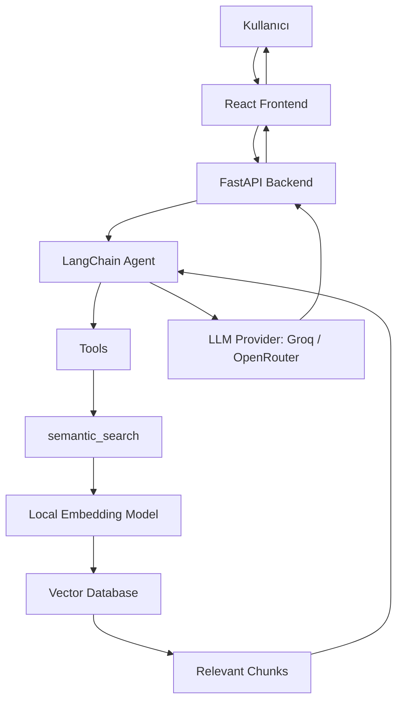
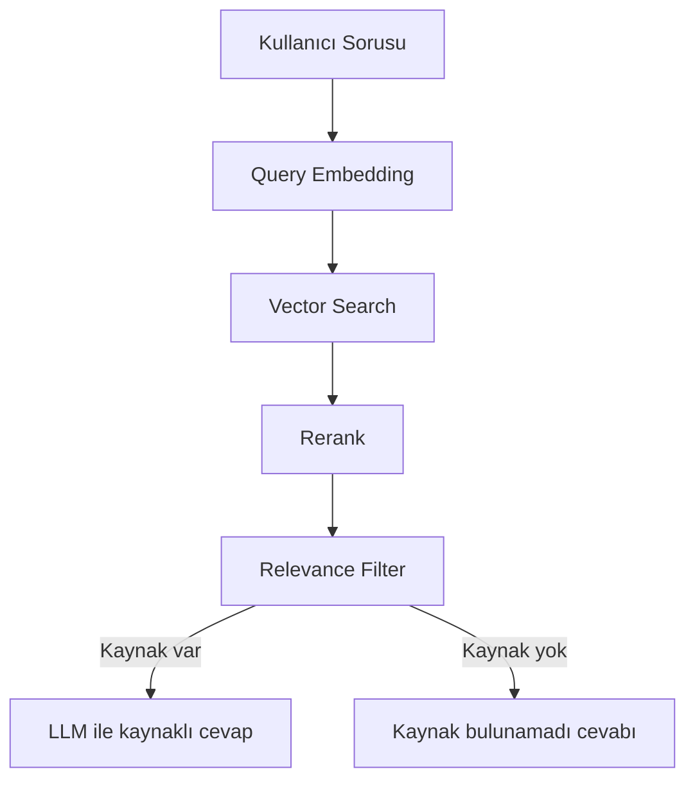
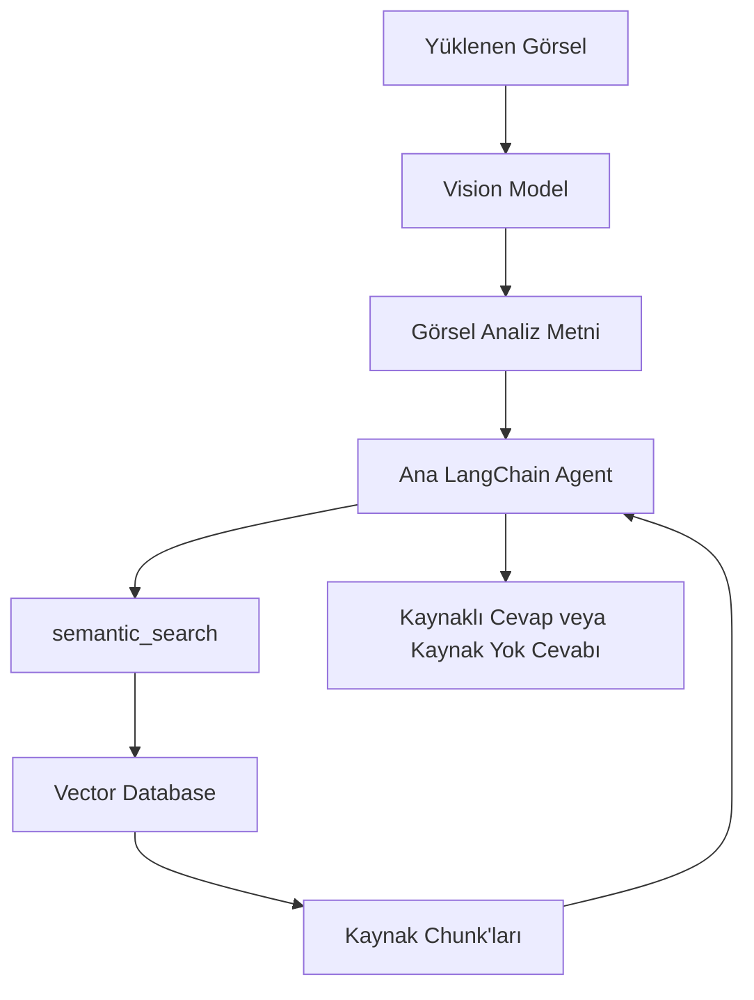

# Maintenance Agent Architecture

## 1. Project Goal

Maintenance Agent, üretim ve bakım ekiplerinin bakım dokümanları üzerinden kaynaklı cevap almasını sağlayan bir RAG tabanlı asistan uygulamasıdır. Kullanıcı PDF, TXT, MD veya CSV dokümanı yükleyebilir; sistem bu dokümanları parçalara böler, embedding üretir ve vector database içinde aranabilir hale getirir.

Uygulamanın temel amacı, bakım, alarm, arıza, güvenlik ve periyodik bakım sorularında LLM'in genel bilgisinden cevap uydurmasını engelleyip cevabı yüklenen kaynak dokümanlara dayandırmaktır.

Kısa sohbet mesajları desteklenir; ancak bakım veya doküman bilgisi gerektiren sorularda kaynak aranır. Kaynak bulunamazsa bot bakım cevabı üretmez.

## 2. High-Level Architecture

Uygulama dört ana katmandan oluşur:

- React frontend: Kullanıcı arayüzü, chat ekranı, Ragas ekranı, ayarlar, kaynaklar ve tool çağrıları paneli.
- FastAPI backend: API endpointleri, doküman yükleme, conversation history, agent akışı ve ayar yönetimi.
- AI/RAG katmanı: LangChain agent, LLM provider, local embedding modeli, semantic search, reranking ve relevance filtering.
- Evaluation katmanı: Golden dataset ve Ragas raporları ile cevap kalitesini ölçme.

## 3. Frontend Architecture

Frontend React ile geliştirilmiştir. Ana görevleri:

- Kullanıcıya giriş ekranında Chat ve Ragas seçeneklerini sunmak.
- Chat ekranında mesajlaşma deneyimini sağlamak.
- Doküman ve görsel yüklemeyi desteklemek.
- Cevaplara ait kaynakları sağ panelde göstermek.
- Tool çağrılarını seçili cevaba veya tüm sohbete göre göstermek.
- Ayarlar sekmesinden LLM provider ve model seçimini yönetmek.
- Ragas ekranında evaluation sonuçlarını ve metrikleri göstermek.

Kaynak paneli seçili cevaba bağlı çalışır. Bir cevap seçiliyse yalnızca o cevabın kaynakları gösterilir. Böylece başka bir cevaptan kalan kaynak yanlışlıkla mevcut cevabın kaynağı gibi görünmez.

## 4. Backend Architecture

Backend FastAPI ile geliştirilmiştir. Başlıca sorumlulukları:

- Chat mesajlarını almak.
- Görsel mesajlarını almak ve vision analizine göndermek.
- Doküman yükleme ve indeksleme sürecini yürütmek.
- Conversation history ve tool call kayıtlarını tutmak.
- LangChain agent akışını çalıştırmak.
- Semantic search sonuçlarını kaynak olarak frontend'e döndürmek.
- Runtime ayarlarını yönetmek.

Temel endpoint grupları:

- `/api/chat`: Metin tabanlı chat soruları.
- `/api/chat/image`: Görsel içeren chat soruları.
- `/api/documents`: Doküman listeleme ve doküman yükleme.
- `/api/conversations`: Sohbet geçmişi.
- `/api/settings`: Provider/model ayarları.
- `/api/evaluation`: Ragas evaluation durumu ve sonuçları.

## 5. RAG Pipeline

RAG akışı iki aşamadan oluşur: doküman indeksleme ve soru cevaplama.

Doküman indeksleme:

1. Kullanıcı doküman yükler.
2. Backend dosya tipine göre metni çıkarır.
3. Metin chunk'lara bölünür.
4. Her chunk için local embedding modeliyle vektör üretilir.
5. Chunk metni, metadata ve embedding vector database'e kaydedilir.

Soru cevaplama:

1. Kullanıcı soru sorar.
2. Soru embedding'e çevrilir.
3. Vector database içinde benzer chunk'lar aranır.
4. İlk adaylar reranking ve relevance filtering aşamalarından geçer.
5. İlgili chunk kalırsa agent cevabı bu kaynaklara göre üretir.
6. İlgili chunk yoksa bakım cevabı uydurulmaz.

## 6. Vision Pipeline

Görsel modeli doğrudan son kullanıcı cevabı üretmez. Görevi yalnızca görseli analiz edip ana agent'a metinsel gözlem sağlamaktır.

Görsel akışı:

1. Kullanıcı görsel yükler.
2. Vision modeli görselde görünen ekipmanı, yazıyı, hata kodunu veya belirgin durumu metne çevirir.
3. Bu analiz metni kullanıcı mesajıyla birleştirilir.
4. Ana agent bu metinle semantic search yapar.
5. Kaynak bulunursa cevap kaynaklara dayanır.
6. Kaynak bulunmazsa bakım prosedürü veya çözüm adımı uydurulmaz.

Bu ayrım önemlidir çünkü vision modeli görselden genel çıkarım yapabilir; ancak bakım uygulamasında güvenilir cevap için doküman kaynağı gerekir.

## 7. Agent and Tools

Ana AI omurgası LangChain ile kurulmuştur. LangChain şu parçalar için kullanılır:

- Model bağlantısı: Groq veya OpenRouter üzerinden chat modeli.
- Prompt yönetimi: Bakım asistanının davranış kuralları.
- Agent: Soruya göre hangi aracın kullanılacağına karar veren yapı.
- Tools: Deterministik hesaplama veya doküman araması yapan araçlar.
- Chat history: Sohbet bağlamını agent'a iletme.

Kullanılan tool'lar:

- `semantic_search`: Yüklenen dokümanlarda anlamsal arama yapar.
- `get_today`: Bugünün tarihini ve haftanın gününü döndürür.
- `date_info`: Belirli bir tarih veya göreli tarih için gün bilgisi verir.
- `calculate_next_maintenance`: Son bakım tarihi ve bakım periyoduna göre sonraki bakım tarihini hesaplar.

Bakım, alarm, güvenlik, makine, arıza veya doküman sorularında `semantic_search` kritik araçtır. Bot kaynak aramadan bakım cevabı vermemelidir.

## 8. Source Grounding and Hallucination Control

Uygulamada grounding, cevabın kaynak dokümanlara bağlanması anlamına gelir.

Hallucination azaltmak için kullanılan kontroller:

- Bakım ve doküman sorularında semantic search yapılır.
- Gelen chunk'lar rerank edilir.
- Relevance filter, kullanıcının sorusuyla gerçekten ilgili olmayan chunk'ları eler.
- Kaynak yoksa guard mekanizması devreye girer.
- Guard, kaynak bulunmadan bakım/alarm/güvenlik cevabı üretilmesini engeller.
- Görsel sorularında bile vision metniyle önce vector search yapılır.

Bu nedenle sistemin temel kuralı şudur:

> LLM tek başına bakım cevabı üretmez; bakım sorularında önce kaynak aranır, kaynak yoksa cevap uydurulmaz.

## 9. Evaluation with Ragas

Ragas, RAG sisteminin cevap kalitesini ölçmek için kullanılır. Bunun için golden dataset hazırlanmıştır.

Golden dataset içinde:

- Kullanıcı sorusu
- Beklenen cevap veya ground truth
- Beklenen kaynak
- Beklenen davranış
- Soru kategorisi

bulunur.

Ragas tarafında takip edilen temel metrikler:

- Faithfulness: Cevap verilen kaynaklara sadık mı?
- Answer relevancy: Cevap kullanıcının sorusuyla ne kadar alakalı?
- Context precision: Getirilen chunk'ların ne kadarı gerçekten işe yarıyor?
- Context recall: Gerekli bilginin ne kadarı getirilen context içinde var?

Bu metriklerle v1, v2, v3 gibi farklı prompt, top_k, filtering veya model ayarları karşılaştırılabilir.

## 10. Known Limitations

- Embedding araması kelime seçimine ve chunk kalitesine duyarlıdır.
- Relevance filter bazen fazla sıkı davranıp ilgili chunk'ı eleyebilir.
- Vision modeli görseldeki nesneyi yanlış yorumlayabilir; bu yüzden son cevap için doküman kaynağı aranır.
- Dokümanda bilgi yoksa bot genel bilgiyle bakım prosedürü üretmemelidir.
- Çok genel sorularda doğru chunk'ı bulmak için kullanıcıdan daha net ekipman, hata kodu veya belirti istenebilir.

## 11. Summary

Maintenance Agent; React frontend, FastAPI backend, LangChain agent, local embedding modeli, vector database, vision analizi ve Ragas evaluation katmanlarından oluşan bir RAG uygulamasıdır.

Sistemin ana değeri, bakım sorularında kaynaklı cevap üretmesi ve kaynak yoksa uydurmamasıdır. Görsel yüklendiğinde bile vision modeli sadece gözlem çıkarır; asıl karar ve cevap ana agent tarafından doküman araması sonucuna göre verilir.
