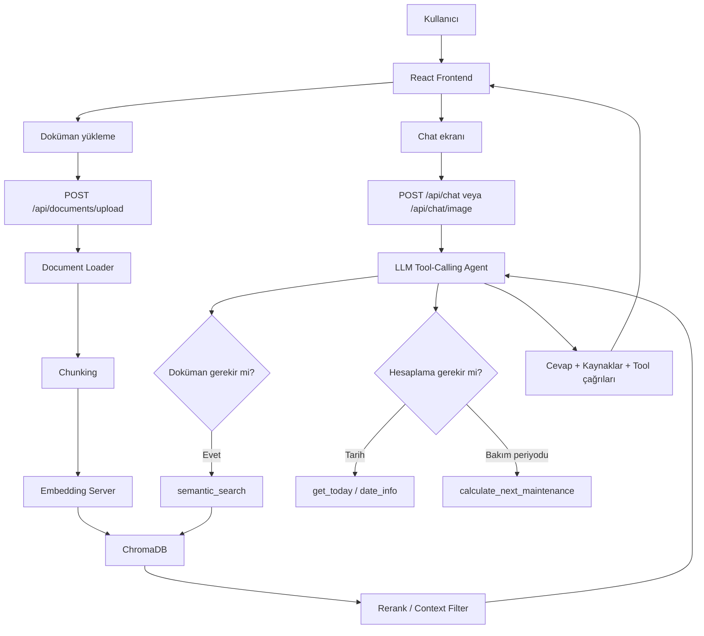

# Manufacturing Maintenance Agent

Fabrika bakım ekipleri için AI bakım asistanı. Sistem bakım dokümanlarını indeksler, alarm ve bakım sorularını kaynaklı cevaplar, deterministik tool çağırır ve Ragas ile offline değerlendirilebilir.

## Mimari

Detaylı mimari dokümanı: [`docs/architecture.md`](docs/architecture.md)

- Backend: Python, FastAPI, Groq, ChromaDB, Pydantic
- Frontend: React, Vite, Axios
- Evaluation: Pytest, Ragas, golden dataset, evaluation reports

## Uçtan Uca Akış

Bu uygulama üç ana parçadan oluşur: kullanıcı arayüzü, backend servisleri ve yerel embedding/vector store katmanı. Kullanıcı doküman yüklediğinde sistem önce dokümanı metne çevirir, sonra küçük parçalara ayırır, embedding üretir ve ChromaDB içine kaydeder. Kullanıcı soru sorduğunda ise agent gerekirse dokümanlarda arama yapar, ilgili chunkları seçer ve cevabı kaynaklarıyla birlikte döndürür.


## Sistem Bileşenleri

- **Frontend:** Kullanıcının chat ekranını, doküman yükleme alanını, kaynakları ve tool çağrılarını gördüğü React arayüzüdür.
- **Backend:** FastAPI ile yazılmıştır. Chat, görsel, doküman yükleme, sohbet geçmişi ve Ragas durum endpointlerini yönetir.
- **LLM Agent:** Kullanıcının sorusunu yorumlar. Gerekirse semantic search, tarih veya bakım periyodu araçlarını çağırır.
- **Embedding Server:** Doküman parçalarını ve kullanıcı sorgusunu sayısal vektöre çevirir.
- **ChromaDB:** Doküman chunklarını ve embeddingleri saklayan yerel vector database katmanıdır.
- **Ragas Evaluation:** Golden dataset üzerinden sistemin cevap kalitesini ölçmek için kullanılır.

## Chat Akışı

1. Kullanıcı frontend üzerinden soru yazar veya görsel gönderir.
2. Frontend isteği backend’e gönderir.
3. Backend konuşma geçmişini ve varsa görsel bilgisini hazırlar.
4. Agent soruyu değerlendirir.
5. Doküman bilgisi gerekiyorsa `semantic_search` aracını çağırır.
6. ChromaDB’den ilgili chunklar gelir.
7. Reranker en alakalı parçaları seçer.
8. LLM bu context ile cevabı üretir.
9. Frontend cevabı, kaynakları ve tool çağrılarını kullanıcıya gösterir.

## Doküman Yükleme Akışı

1. Kullanıcı PDF, TXT, MD veya CSV dosyası yükler.
2. Backend dosyayı `backend/data/uploads` altına kaydeder.
3. Dosya metne çevrilir.
4. Metin chunklara ayrılır.
5. Her chunk için embedding üretilir.
6. Chunk metni, metadata ve embedding ChromaDB’ye yazılır.
7. Kullanıcı artık bu doküman hakkında soru sorabilir.

## Backend çalıştırma

```bash
cd backend
python -m venv .venv
source .venv/bin/activate
pip install -r requirements.txt
cp .env.example .env
uvicorn app.main:app --reload
```

`backend/.env` içinde `GROQ_API_KEY` girilirse model cevabı üretir. Anahtar yoksa sistem indeksleme ve routing katmanlarını çalıştırır, model cevabı için uyarı döner.

## Frontend çalıştırma

```bash
cd frontend
pnpm install
pnpm run dev
```

Uygulama varsayılan olarak `http://localhost:5173` adresinden açılır.

## Yerel embedding sunucusu

Backend, varsayılan olarak yerel `embeddinggemma-300M-GGUF` sunucusunu
`http://127.0.0.1:8080/embedding` adresinden kullanır. Sunucuyu backend'den
önce başlat:

```bash
llama-server -hf ggml-org/embeddinggemma-300M-GGUF --embeddings
```

Endpoint veya koleksiyon adı `backend/.env` içindeki `EMBEDDING_ENDPOINT` ve
`EMBEDDING_COLLECTION_NAME` ayarlarıyla değiştirilebilir. Model değiştiğinde
eski vektör boyutlarıyla karışmaması için yeni bir koleksiyon adı kullanılmalıdır.
Mevcut dokümanların yeni koleksiyona yazılması için embedding sunucusu açıldıktan
sonra dokümanları yeniden yükle.

## Test

```bash
cd backend
pytest
```

## Ragas Evaluation

Ragas runtime içinde değil, offline değerlendirme aşamasında çalışır.

```bash
python evaluation/run_ragas.py
```

Önce `evaluation/golden/golden_dataset.jsonl` içindeki `answer` ve `contexts` alanlarını uygulama çıktılarıyla doldur.
