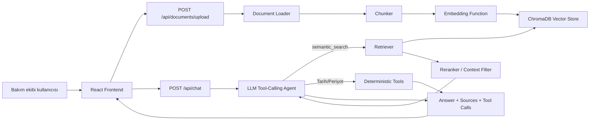
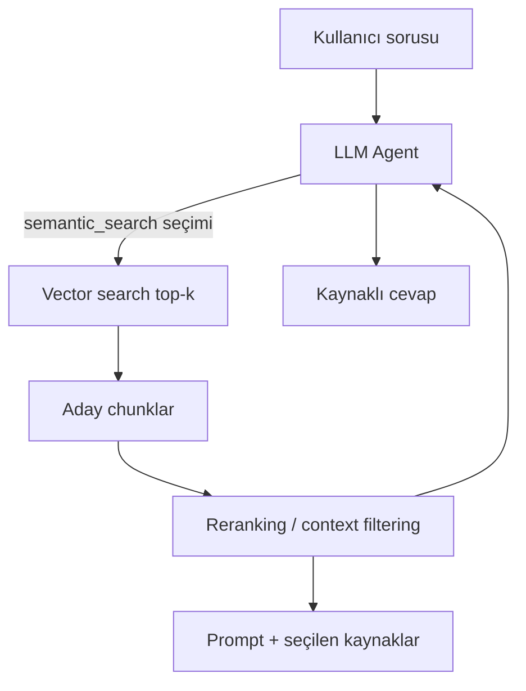

# Manufacturing Maintenance Agent Architecture

## 1. Proje Amacı

Manufacturing Maintenance Agent, fabrika bakım ekipleri için tasarlanan kaynaklı cevap verebilen bir AI bakım asistanıdır. Kullanıcı bakım dokümanı, alarm kodları listesi, iş güvenliği talimatı veya periyodik bakım prosedürü yükleyebilir. Sistem bu dokümanları parçalara ayırır, embedding üretir, vector database içine kaydeder ve kullanıcının bakım sorularına kaynak göstererek cevap verir.

Bu projede temel amaç sadece bir chatbot yapmak değildir. Amaç, bakım alanında güvenilir davranan, kaynakta bilgi yoksa uydurmayan, gerekli aracı LLM'in seçtiği ve offline olarak Ragas ile ölçülebilen bir AI ürün mimarisi kurmaktır.

## 2. Kapsam

Sistem şu yetenekleri destekleyecek şekilde hazırlandı:

- Doküman yükleme: PDF, TXT, MD ve CSV formatları için temel destek.
- Doküman işleme: text extraction, chunking, embedding ve ChromaDB indeksleme.
- Chat API: kullanıcı sorusunu LLM kontrollü tool-calling agent'a iletir.
- Reranking/context filtering: getirilen chunkları tekrar sıralar ve en işe yarar contextleri seçer.
- Tool calling: LLM; semantic search, tarih ve bakım periyodu araçlarından gerekeni seçer.
- Kaynaklı cevap: cevapla birlikte doküman adı, chunk id ve skor döner.
- Offline evaluation: Ragas metrikleri için golden dataset ve rapor yapısı sağlar.
- Frontend: doküman yükleme, chat ekranı, kaynak paneli ve tool call paneli sunar.

## 3. Üst Seviye Mimari



## 4. Klasör Yapısı

```text
backend/
  app/
    api/              FastAPI endpointleri
    core/             ayar ve environment yönetimi
    models/           Pydantic request/response şemaları
    services/         RAG, LLM, reranker ve agent servisleri
    tools/            deterministic tool fonksiyonları
  data/
    uploads/          yüklenen dokümanlar
    chroma/           local ChromaDB persistence alanı
  tests/              backend birim testleri

docs/
  api-contract.md     minimum API contract
  architecture.md     bu mimari doküman

evaluation/
  golden/             golden dataset örnekleri
  reports/            Ragas rapor çıktıları
  run_ragas.py        offline evaluation scripti

frontend/
  src/
    api/              backend client fonksiyonları
    components/       ileride ayrıştırılacak UI bileşenleri
    types/            API response tipleri
    App.tsx           ana chat/upload ekranı
```

## 5. Backend Mimarisi

Backend FastAPI üzerine kuruldu. Amaç, AI akışını endpoint içinde karmaşıklaştırmadan servis katmanlarına bölmektir. Bu sayede Merve her parçayı ayrı ayrı açıklayabilir: endpoint sadece isteği alır, agent karar verir, RAG servisi dokümanla çalışır, tool katmanı deterministik sonuç üretir.

Ana dosyalar:

- `backend/app/main.py`: FastAPI uygulaması, CORS ayarı ve router bağlantısı.
- `backend/app/api/routes.py`: `/api/chat` ve `/api/documents/upload` endpointleri.
- `backend/app/models/schemas.py`: API request/response modelleri.
- `backend/app/core/config.py`: `.env` ve runtime ayarları.
- `backend/app/services/agent.py`: LLM tool-calling döngüsünü ve araç çalıştırmayı yöneten katman.
- `backend/app/services/vector_store.py`: ChromaDB bağlantısı, chunk ekleme ve arama.
- `backend/app/services/reranker.py`: gelen contextleri tekrar sıralama.
- `backend/app/services/llm.py`: Groq model çağrısı ve sistem promptu.
- `backend/app/tools/deterministic_tools.py`: tarih ve bakım periyodu araçları.

## 6. Doküman Yükleme ve İndeksleme Akışı

Kullanıcı frontend üzerinden doküman yüklediğinde `POST /api/documents/upload` endpointi çalışır.

Akış:

1. Dosya backend tarafında `backend/data/uploads` altına kaydedilir.
2. `document_loader.py` dosya tipine göre metin çıkarır.
3. `chunker.py` metni overlap içeren chunklara böler.
4. Her chunk için stabil bir `chunk_id` üretilir.
5. `vector_store.py` chunk metinlerini ve metadata bilgilerini ChromaDB içine ekler.
6. API kullanıcıya `document_id`, `document_name`, `chunks_count` ve `status` döner.

Response örneği:

```json
{
  "document_id": "doc_123",
  "document_name": "maintenance_manual.pdf",
  "chunks_count": 42,
  "status": "indexed"
}
```

Bu akış RAG sisteminin bilgi tabanını oluşturur. Doküman yüklenmeden RAG sorularında sistem kaynak bulamaz ve uydurma cevap üretmez.

## 7. Chat ve Agent Akışı

Kullanıcı soru sorduğunda `POST /api/chat` endpointi çalışır. Endpoint isteği doğrudan `answer_message` fonksiyonuna verir. LLM, kendisine sunulan araç açıklamalarına bakarak araç çağırıp çağırmayacağına karar verir.

Chat akışı:

1. Kullanıcının mesajı alınır.
2. Groq üzerindeki LLM ilk cevabında doğrudan yanıt verebilir veya bir araç çağrısı isteyebilir.
3. Agent seçilen aracı gerçek argümanlarla çalıştırır ve sonucu LLM'e `ToolMessage` olarak döndürür.
4. `semantic_search` seçildiyse ChromaDB top-k chunk getirir ve reranker en iyi contextleri seçer.
5. LLM araç sonucunu değerlendirir; gerekirse başka araç çağırır veya nihai cevabı üretir.
6. Final response içinde answer, sources ve tool_calls döner.

Response örneği:

```json
{
  "answer": "E42 alarmı motor sıcaklığının limit üstüne çıktığını gösterir.",
  "sources": [
    {
      "document_name": "alarm_codes.pdf",
      "chunk_id": "doc_123_c12",
      "score": 0.84
    }
  ],
  "tool_calls": [
    {
      "name": "semantic_search",
      "input": {"query": "E42 alarm kodu ne anlama geliyor?"},
      "output": {"matches": []}
    }
  ]
}
```

## 8. LLM Tool Seçimi

Sistemde soru tipini önceden belirleyen bir router yoktur. LLM şu araçların adını, açıklamasını ve parametre şemasını görür:

- `semantic_search`: yüklenen bakım dokümanlarında anlamsal arama.
- `get_today`: bugünün tarihini alma.
- `calculate_next_maintenance`: son bakım tarihi ve periyottan yeni tarih hesaplama.

Model soruyu değerlendirir, gereken aracı çağırır ve araç sonucuna göre nihai cevabı üretir. Araç gerektirmeyen sohbetlerde doğrudan cevap verir.

## 9. RAG Tasarımı

RAG, bu projenin ana mimarisidir. Modelin bakım alanında uydurma cevap vermesini engellemek için bilgi kaynağı olarak yüklenen dokümanlar kullanılır.

RAG pipeline:



RAG katmanında tutulan metadata:

- `document_id`: dokümanın sistem içi id değeri.
- `document_name`: kullanıcıya gösterilecek dosya adı.
- `chunk_id`: cevabın hangi chunklardan üretildiğini gösteren id.
- `score`: retriever/reranker sonrası yakınlık skoru.

## 10. Reranking / Context Filtering

Retriever genellikle en yakın chunkları getirir, fakat bu chunkların hepsi cevap için eşit derecede faydalı olmayabilir. Bu yüzden ikinci bir seçim katmanı eklendi.

İlk sürümde reranker basit ve açıklanabilir tutuldu:

- Soru içindeki anlamlı kelimeler çıkarılır.
- Her context içinde keyword hit sayısı hesaplanır.
- Retriever skoru keyword uyumu ile küçük bir ağırlık üzerinden artırılır.
- En iyi `RERANK_TOP_N` context Groq modeline gönderilir.

Bu yaklaşım final case için yeterli bir başlangıçtır. İleride cross-encoder reranker veya LLM tabanlı context evaluator ile değiştirilebilir.

## 11. LLM ve Prompt Engineering

LLM sağlayıcısı Groq olarak konumlandı. `llm.py` içinde sistem promptu bakım asistanının davranış kurallarını belirler.

Prompt kuralları:

- Sadece verilen bakım contextine dayanarak cevap ver.
- Context yeterli değilse bunu açıkça söyle.
- Alarm anlamı, güvenlik talimatı veya bakım prosedürü uydurma.
- Cevabı pratik ve kısa tut.
- Kaynak chunk idlerini anlaşılır şekilde kullan.

Bu tasarımda araç seçimini LLM yapar; araçların gerçek çalışması uygulama kodunda kontrollü biçimde yürütülür.

## 12. Tool Calling Tasarımı

Tool calling hem doküman araması hem hesaplanabilir işler için kullanılır. LLM hangi aracın gerektiğine karar verir; tarih hesaplama gibi işlemin kendisi yine deterministik Python fonksiyonunda yapılır.

Mevcut tools:

- `semantic_search`: ChromaDB araması yapar ve seçilen chunkları döner.
- `get_today`: bugünün tarihini ISO formatında döner.
- `calculate_next_maintenance`: son bakım tarihi ve interval gün sayısından sonraki bakım tarihini hesaplar.

Örnek soru:

```text
2026-06-01 tarihinden 30 gün sonra sonraki bakım ne zaman?
```

Beklenen tool çıktısı:

```json
{
  "last_date": "2026-06-01",
  "interval_days": 30,
  "next_maintenance_date": "2026-07-01"
}
```

## 13. Frontend Mimarisi

Frontend React ve Vite ile hazırlandı. İlk hedef çalışan bir ürün ekranı kurmaktır; marketing sayfası değil, doğrudan kullanılabilir bakım asistanı ekranı vardır.

Frontend parçaları:

- Chat alanı: kullanıcı sorusunu yazar ve asistan cevabını görür.
- Doküman yükleme: PDF/TXT/MD/CSV dosyası backend'e gönderilir.
- Sources panel: cevabın dayandığı dokümanları ve chunk idlerini gösterir.
- Tool call panel: LLM'in seçtiği ve agent'ın çalıştırdığı araçları gösterir.

Ana dosyalar:

- `frontend/src/App.tsx`: ana ekran ve state yönetimi.
- `frontend/src/api/client.ts`: backend API çağrıları.
- `frontend/src/types/api.ts`: response tipleri.
- `frontend/src/styles.css`: responsive ve sade arayüz stilleri.

## 14. API Contract

Minimum API contract `docs/api-contract.md` içinde ayrıca tutulur. Backend ve frontend aynı contract üzerinden konuşur.

Temel endpointler:

| Method | Path | Amaç |
| --- | --- | --- |
| `POST` | `/api/documents/upload` | Doküman yükleme ve indeksleme |
| `POST` | `/api/chat` | Kullanıcı sorusunu cevaplama |
| `GET` | `/health` | Backend sağlık kontrolü |

Bu contract sabit tutulduğu sürece frontend ve backend bağımsız geliştirilebilir.

## 15. Ragas Offline Evaluation

Ragas runtime içinde çalıştırılmaz. Canlı kullanıcı isteğinin parçası değildir. Bunun yerine offline evaluation aşamasında kullanılır.

Evaluation akışı:

1. Golden dataset hazırlanır.
2. Her soru için beklenen cevap veya ground truth yazılır.
3. Uygulamanın ürettiği answer ve contexts alanları dataset içine eklenir.
4. `evaluation/run_ragas.py` çalıştırılır.
5. Sonuçlar `evaluation/reports` altında raporlanır.

Ölçülecek metrikler:

- `faithfulness`: cevap verilen contextlere sadık mı?
- `answer_relevancy`: cevap soru ile alakalı mı?
- `context_precision`: getirilen contextler gerçekten gerekli mi?
- `context_recall`: gerekli contextler retrieve edilmiş mi?

Bu ayrım önemli: Ragas kaliteyi ölçer, production cevabı üretmez.

## 16. Güvenilirlik ve Hallucination Kontrolü

Bakım ve iş güvenliği domaininde yanlış bilgi risklidir. Bu yüzden sistemde birkaç koruma vardır:

- RAG sorularında kaynak yoksa cevap uydurmaz.
- Prompt modelden sadece verilen context üzerinden cevap istemektedir.
- Sources response içinde açıkça döner.
- Araç seçimini LLM yapar; hesaplama ve arama uygulama araçlarında kontrollü biçimde çalışır.
- Evaluation offline olarak Ragas ile ölçülür.

İlk sürümde bu korumalar temel seviyededir. Production seviyesinde ek olarak threshold kontrolü, daha güçlü reranker, kullanıcı yetkilendirmesi, audit log ve doküman versiyonlama eklenmelidir.

## 17. Environment ve Konfigürasyon

Backend ayarları `.env` üzerinden yönetilir. Örnek dosya: `backend/.env.example`.

Önemli değişkenler:

| Değişken | Açıklama |
| --- | --- |
| `GROQ_API_KEY` | Groq API anahtarı |
| `GROQ_MODEL` | Kullanılacak Groq modeli |
| `EMBEDDING_MODEL` | Sentence Transformers embedding modeli |
| `CHROMA_PERSIST_DIR` | ChromaDB kayıt klasörü |
| `UPLOAD_DIR` | Yüklenen dosyaların tutulacağı klasör |
| `TOP_K` | Retriever'ın getireceği chunk sayısı |
| `RERANK_TOP_N` | LLM'e gönderilecek final context sayısı |

## 18. Geliştirme ve Çalıştırma

Backend:

```bash
cd backend
python -m venv .venv
source .venv/bin/activate
pip install -r requirements.txt
cp .env.example .env
uvicorn app.main:app --reload
```

Frontend:

```bash
cd frontend
pnpm install
pnpm run dev
```

Test:

```bash
cd backend
pytest
```

Frontend build doğrulaması:

```bash
cd frontend
pnpm run build
```

## 19. Şu Ana Kadar Hazırlananlar

Bu aşamada proje boş bir repodan çalışan bir mimari iskelete dönüştürüldü.

Hazırlanan backend parçaları:

- FastAPI uygulaması ve CORS ayarı.
- Chat endpointi.
- Doküman upload endpointi.
- Pydantic API modelleri.
- Doküman loader.
- Chunker.
- ChromaDB vector store katmanı.
- Basit reranker/context filter.
- Groq LLM çağrı katmanı.
- Deterministic tool fonksiyonları.
- Agent ve chunker için başlangıç testleri.

Hazırlanan frontend parçaları:

- React/Vite uygulaması.
- Chat UI.
- Doküman upload UI.
- Sources panel.
- Tool call panel.
- Backend API client.

Hazırlanan evaluation parçaları:

- Golden dataset örneği.
- Ragas evaluation scripti.
- Reports klasörü.

Hazırlanan dokümantasyon:

- README.
- API contract.
- Mimari dokümanı.

## 20. Bilinen Sınırlar ve Sonraki Adımlar

Bu iskelet final case için güçlü bir başlangıçtır, fakat production-ready sistem değildir.

Sonraki teknik adımlar:

1. Groq API key eklenip gerçek model cevabı test edilmeli.
2. Örnek alarm kodu ve bakım prosedürü dokümanları yüklenmeli.
3. Retrieval threshold eklenmeli; düşük skor varsa LLM çağrısı yapılmamalı.
4. Reranker daha güçlü bir yöntemle iyileştirilmeli.
5. Conversation memory ihtiyacı netleştirilmeli.
6. Ragas dataset gerçek uygulama çıktılarıyla doldurulmalı.
7. Backend testleri endpoint seviyesine genişletilmeli.
8. Frontend bileşenleri `components/` altına ayrıştırılmalı.
9. İlk commit atılıp GitHub'a push yapılmalı.

## 21. Mimari Karar Özeti

| Karar | Gerekçe |
| --- | --- |
| FastAPI kullanımı | Hızlı API geliştirme, Pydantic ile güçlü contract, Python AI ekosistemiyle uyum |
| ChromaDB kullanımı | Local geliştirme için kolay persistent vector database |
| Groq kullanımı | Hızlı LLM inference ve case gereksinimiyle uyum |
| RAG ana mimari | Bakım dokümanlarından kaynaklı cevap üretmek için zorunlu |
| LLM tool calling | Araç seçimini modele bırakırken gerçek işlemleri kontrollü fonksiyonlarda çalıştırmak için |
| Ragas offline | Runtime performansını etkilemeden kalite ölçmek için |
| React frontend | Chat, upload ve panel bazlı ürün ekranını hızlı kurmak için |

## 22. Kısa Anlatım

Bu projede kullanıcı doküman yükler, backend dokümanı chunklara böler ve ChromaDB içine kaydeder. Kullanıcı soru sorduğunda LLM doğrudan cevap vermeye veya semantic search, tarih ya da bakım hesabı araçlarından birini çağırmaya karar verir. Agent aracı çalıştırıp sonucunu LLM'e geri verir. Cevap frontend'e answer, sources ve tool_calls bilgileriyle döner. Ragas ise canlı sistemde değil, offline evaluation aşamasında kalite ölçümü için kullanılır.
## Ana RAG akışı

Web uygulaması agent tabanlı RAG kullanır:

Kullanıcı sorusu
→ POST /api/chat
→ agent.py
→ LLM araç gerekip gerekmediğine karar verir
→ Gerekirse semantic_search çağrılır
→ Chroma ilgili chunk'ları getirir
→ LLM kaynaklı cevap üretir

`retrieval_chain.py`, `create_retrieval_chain` yapısını öğrenmek ve
karşılaştırmak için hazırlanmış bir deneydir. Web uygulamasının aktif
RAG akışında kullanılmaz.
